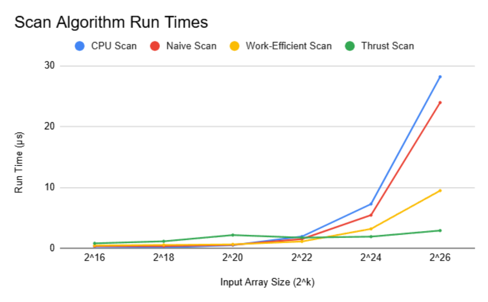

CUDA Stream Compaction
======================

**University of Pennsylvania, CIS 565: GPU Programming and Architecture, Project 2**

* Lewis Ghrist  
* [Personal Website](https://siwel-cg.github.io/siwel.cg_websiteV1/index.html#home), [LinkedIn](https://www.linkedin.com/in/lewis-ghrist-4b1b3728b/)
* Tested on: Windows 11, AMD Ryzen 9 5950X 16-Core Processor, 64GB, NVIDIA GeForce RTX 3080 10GB

---

## Overview
Often when thinking about parallelization, we think of use cases that are already inherintly parallel by nature in that each calculation doesn't really depend on eachother. Things like running a series calculations on every particle or each pixel of the screen. With these, we can ofcourse assign each element to a thread, and do the calculations all at once. However, what about problems which seem be purely sequenctial? In this project, I implement two such problems, scan and stream compaction, which take advantage of GPU parallelization to reduce the total number of operations performed. A naive CPU version was also implemneted for comparisson.

### Scan
The Scan problem is simply: given an array of elements and some binarry operation which can combine two elements, we want to return the "sum" of any element with all the elements before it. In this implementation we we looking at specifically summing an array of integers, however any group can work (see later note on groups). There are two different types of the scan algorithm: Exclusive Scan and Inclusive Scan. In an Exclusive Scan, index i in our result array will contain the sum of all elements with idices stricly less than i. That is, the ith element in our input will not be included in the sum stored in the ith element of our output. This means our first output element will always be 0 and the last element in our input is never added and is irelivant to the output. For an Inclusive Scan, we do take into account the ith element in our sum. This means the first element of our output is always the first elment of our input, and the last element of our output is the sum of all elements in the array. In this project I implemented Exclusive Scans, but it is simple to convert between the two types deppending on the use case.

<ins>CPU Scan<ins>

This was implemented as a simple for loop which adds the current element with the result of the previous iteration and thus perfoms the prefix sum. As expected, we have n-1 adds with a total asymtotic runtime of O(n). Very strait forward, but critically, this is a sequencial operation with no parallelization. Although, for relatively small inputs this is significantly faster than the more complex GPU algorithms we implement, as our input grows this becomes much slower. 

<ins>Naive Parallel Scan<ins>

If we expand out each sum in our sequenctial sum, we see that we can break down that entire thing into independent pairs of sums. Then, once again, we can break those down into pairs of sums, and so on untill finally we have just one value left. The result looks like a binary tree where at each level we do half the number of adds of the previous level. Note also that at each level, we have actually already completed a sum for some of the outputs. One additional precaution is that we need our input array to be a power of 2. This can easilly be handled by padding our array with identity elemets (0) to avoid changing the result while still ensuring these pairs can always be found. The advantage of doing things this way is that each individual sum in a layer doesn't rely on the others, and can thus be computed in parallel. In my implementation, since we are reading and writing to the same array, I used a ping-pong array system for the output to avoid any incorrect adds. Overall, we get $O(nlog_2(n))$ adds with an asymtotic time of $O(log_2(n))$. Note, although we are doing many more adds, since they can be done in parallel, for sufficiently large inputs and we will still see an improvement.


<ins>Work-Efficient Parallel Scan<ins>

Although it might not be obvious at first we can actually cut out some of the addition operations as well as ordering our data in such a way that we don't need to ping-pong memory. The way we do this is through two passes on the array: Up Sweep nd Down Sweep. First is Up Sweep. Again, we take advantage of the associative property of our operation to split up add operations into a binary tree. However, rather than storing the sums into a new array, we store them back into the same array. Because of the ordering of the sums being completely disjoint, we don't run into the same problems as the naive implementation. The result of Up Sweep is not our completed scan, but it gets us half way in that we now have multiple sub sums we can reference in Down Sweep. In down sweep, we trace the tree down the opossite way. For the pairs in each level (Left and Right), we store Left+Right in Right's index and store Right in Left's index. By doing this down all the levels, we get a complete prefix sum array. It can be unintuative to see why this works, I would suggest looking at the pictures bellow and tracing out which indices and values go where. Once again, we need to pad our input array with identity elements if it is not a power of 2.

One advantage of using this particular tree structure, which we can use to further improve run times, is that for smaller levels, we don't need as many blocks per threads. This is because alot of the threads we would run would end up being useless if we used all of the threads needed for the most dense layer. Thus we can shrink the grid size based on the layer we are in, thus resulting in fewer total threads an a faster run time without sacrificing any results. SPOILER ALLERT: this is also useful for the GPU stram compaction in the next section since it reuses this scan implementation.


---

### Stream Compaction
The second part of this project implemented stream compaction of the input array by removing unwanted elements, which in this case was removing all 0 elements from our array of ints. Again, a sequencial algorithm seems obvious and possibly neessary. However, using this scan function we can parallelize how we find the end indices for each non-zero element as well as how we place those into our output array. Again, for comparisson, I implemented both a basic CPU version and this parallelized version.

<ins>CPU Stream Compaction<ins>

As expected, this was implemented using a for loop and only adding elements to our new array if that elements is not 0. In the end we get the compacted version of our input array. Similarlly to scan, we are sequentially going through each element resulting in an asymtotic run time of $O(n)$. For the same reasons, this is better on small inputs, but won't scale as well as the parallel algorithm.


<ins>GPU Stream Compaction<ins>

To parallelize this task, let's first think about what information we need to find. First, we need to know which elements of our input are good and which should be removed. This is obviously parallel since for each element we are doing the same check. A simple kernel which checks the element in index i and stores weather or not it is acceptable in index i of a boolean array can quickly do this. Next, now that we know which elements we should keep and their indices, we need to figure out which index in our out array should hold that element. This is the 'shift' step where after removing an element, we shift the entire array down to fill in the gap. To find this in parallel, we can actually reuse our scan algorithm. If we format our boolean array as 0s and 1s, performing scan on this algorithm will give us the exact indices we are looking for. For each element we want to keep, the scan result for that element's index will be the number of good elements that come before it since we are summing up all the 1's. Thus, we now know which elements we should keep, and their desired index in our output array. We can then read, in parallel, both our boolean array and our index array and only put the good elements into our output at the correct spots. As for the asymtotics of this algorithm, the most expensive step is actually doing the scan, which if we use our work efficient parallel scan, we get a time of $O(n)$. 


### Thrust

In addition to my custom implementations of these algorithms, I also used a third party library (Thrust) implementations for comparison.

---

### A Quick Note On Groups
As mentioned earlier, with the Scan algorithm, and thus Stream Compaction aswell, we are simply given an array of elements and some operation that can be used on those elements. If we look further into the algorithm however, we see that two more conditions need to be met: our operation must be associative and there must be an identity element. This is precicely the axioms needed for a group! Although in practice we would need to do a bit more work and memory managment if our group element isn't a simple number that can be stored in an array, the algorithm will still work as expected. There is just one other thing we need to be careful of when implementing Down Sweep in the Work Efficient Scan: Commutativity. For many groups, including our intager addition we implemented, our group is abelian, which means A+B = B+A as you would expect. However this is not the case for all groups. For example, matrix multiplications is not-commutative and thus we need to be extra cearful when multiplying to ensure we maintain the ordering of or initial array. As presented in the pictures above, when doing the swap/combine step of two elements, doing Left * Right will actually break the order of our input array. However, if we do Right * Left at each step, we see the ordering gets maintained, meaning that we can still use these efficient methods for non-abelian groups. 

---
## Results

Below are the run time results across a varying size of inputs. Note 2^16 = 65536, 2^18 = 262144, 2^20 = 1048576, 2^22 = 4194304, 2^24 = 16777216, and 2^26 = 67108864. The block size for each algorith are as follows:
Naive Scan: 128, Work-Efficient Scan: 64, Work-Efficient Compact: 256. These ended up being the best after comparing result times across various different block sizes.

### Run Time Graphs and Data

<ins>Non-Logarithmic Scale<ins>



<ins>Logarithmic Scale<ins>


### Program Output

This was run on an input size of $2^24$ and a non-power of 2 input size of $2^24 - 7$

```
****************
** SCAN TESTS **
****************
    [  32   0  23  12   8  47  34  34  22  42  24  10   8 ...   3   0 ]
==== cpu scan, power-of-two ====
   elapsed time: 7.0592ms    (std::chrono Measured)
    [   0   0  23  35  43  90 124 158 180 222 246 256 264 ... 410816752 410816752 ]
==== cpu scan, non-power-of-two ====
   elapsed time: 7.416ms    (std::chrono Measured)
    [   0   0  23  35  43  90 124 158 180 222 246 256 264 ... 410816646 410816680 ]
    passed
==== naive scan, power-of-two ====
   elapsed time: 5.90557ms    (CUDA Measured)
    passed
==== naive scan, non-power-of-two ====
   elapsed time: 5.7576ms    (CUDA Measured)
    passed
==== work-efficient scan, power-of-two ====
   elapsed time: 2.72982ms    (CUDA Measured)
    passed
==== work-efficient scan, non-power-of-two ====
   elapsed time: 2.55734ms    (CUDA Measured)
    passed
==== thrust scan, power-of-two ====
   elapsed time: 1.64688ms    (CUDA Measured)
    passed
==== thrust scan, non-power-of-two ====
   elapsed time: 0.847552ms    (CUDA Measured)
    passed

*****************************
** STREAM COMPACTION TESTS **
*****************************
    [   3   0   3   2   3   0   3   3   3   2   2   0   1 ...   0   0 ]
==== cpu compact without scan, power-of-two ====
   elapsed time: 25.0897ms    (std::chrono Measured)
    [   3   3   2   3   3   3   3   2   2   1   2   3   2 ...   1   3 ]
    passed
==== cpu compact without scan, non-power-of-two ====
   elapsed time: 24.6968ms    (std::chrono Measured)
    [   3   3   2   3   3   3   3   2   2   1   2   3   2 ...   2   1 ]
    passed
==== cpu compact with scan ====
   elapsed time: 53.5246ms    (std::chrono Measured)
    [   3   3   2   3   3   3   3   2   2   1   2   3   2 ...   1   3 ]
    passed
==== work-efficient compact, power-of-two ====
   elapsed time: 0.598624ms    (CUDA Measured)
    passed
==== work-efficient compact, non-power-of-two ====
   elapsed time: 0.587712ms    (CUDA Measured)
    passed

```
---

## Performance Analysis

As can be seen in the graphs, as the size of our input increases, we see the GPU algorithms performing better than the CPU implementations. This is because the CPU implementations are performing the operations sequencially and thus are directly dependent on the input size. However, we see that our GPU implementations tend to follow a less steep increase overall due to the tree structures we use. This is particularly noticable in the first graph without the logarithmic data scalling. Of course, as I mentiond before, for input sizes roughly $<= 2^20$ we still see the CPU implementation performing better. This is due to fixed costs on the GPU. For samll input sizes, each kernel launch has some latency, which means for our scan/compaction algorithms where we do O(log n) kernel passes, we loose some time. Additionally, with to few elements, the GPU cannot fill enough warps to hide memory latency. Meanwhile, the CPU’s simple loop runs have enough cach space with very low latency to run efficiently. Beyond ~2^20 elements these fixed costs are amortized, the GPU has enough elements to shine in parallel, and the tree-based parallel scans/compaction become better than the CPU.

---
## References
- [Nvidia Developer GPU Gems 3 ](https://developer.nvidia.com/gpugems/gpugems3/part-vi-gpu-computing/chapter-39-parallel-prefix-sum-scan-cuda)